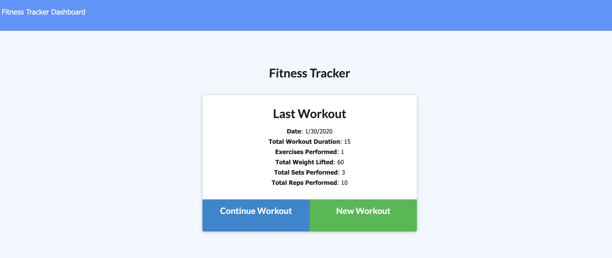

# Fitness Tracker
## User Story
As a fitness enthusiast  

I want to be able to view, create, and track daily workouts. I want to be able to log multiple exercises in any given day. I should also be able to track the name, type, weight, sets, reps, and duration of each exercise 

So that I can gauge my progress

## Description and Usage
This tracker allows users to record and track their exercises and compare the stats over time. 

To begin tracking your workouts, click the 'New Workout' button and select the exercise type; resistance or cardio. Next, complete the form with your workout details and click 'Add Exercise'. Clicking the 'Complete' button will bring you to the Fitness Tracker main page. Upon returning to the main page, you will see a summary of your last workout. You can choose to continue adding to your last workout by clicking 'Continue Workout' or you can create a whole new workout by clicking the 'New Workout' button.

If you would like to view your workout stats, click the 'Dashboard' link in the top left corner of the Fitness Tracker main page. This dashboard allows you to see your progress over time.

[Click here to start tracking your workouts!](https://fitness-tracker2020.herokuapp.com/)

## Technology
* MongoDB
* Mongoose
* mLab

## What I Learned
I learned many new concepts and skills while creating this fitness tracker. A few of which include:
* Creating a Mongo database
* Creating and using a Mongoose schema
* Deploying with mLab
* Utilizing Robo 3T
